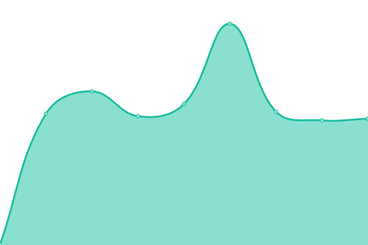
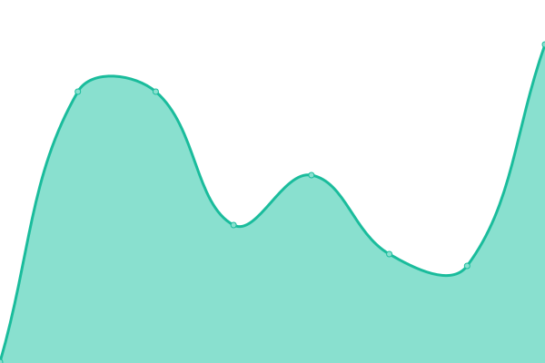
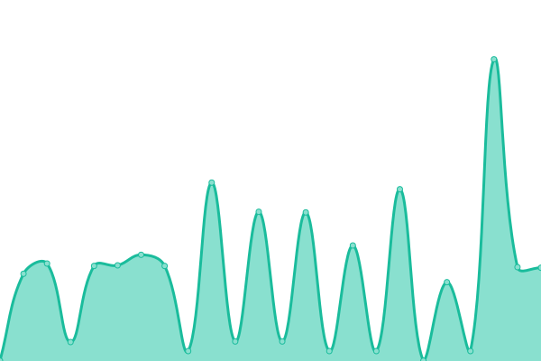
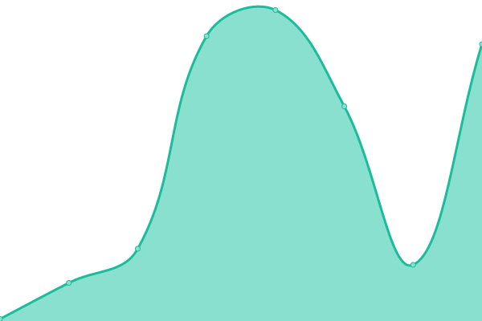

# [📈 Live Status](https://m1xzg.github.io/uptime): <!--live status--> **🟧 Partial outage**

This repository contains the open-source uptime monitor and status page for [Robert McKenzie](https://www.uk-experience.com), powered by [Upptime](https://github.com/upptime/upptime).

<!--start: status pages-->
<!-- This summary is generated by Upptime (https://github.com/upptime/upptime) -->
<!-- Do not edit this manually, your changes will be overwritten -->
<!-- prettier-ignore -->
| URL | Status | History | Response Time | Uptime |
| --- | ------ | ------- | ------------- | ------ |
|  [Home](https://home.rpmdp.com) | 🟩 Up | [home.yml](https://github.com/M1XZG/uptime/commits/HEAD/history/home.yml) | 

 428ms
     
 | 

<a href="https://m1xzg.github.io/uptime/history/home">100.00%</a>
    

|  [HA Proxy](http://minecraft.rpmdp.com) | 🟩 Up | [ha-proxy.yml](https://github.com/M1XZG/uptime/commits/HEAD/history/ha-proxy.yml) | 

 205ms
     
 | 

<a href="https://m1xzg.github.io/uptime/history/ha-proxy">100.00%</a>
    

|  [Flight Tracker](http://minecraft.rpmdp.com/fa/) | 🟩 Up | [flight-tracker.yml](https://github.com/M1XZG/uptime/commits/HEAD/history/flight-tracker.yml) | 

 274ms
     
 | 

<a href="https://m1xzg.github.io/uptime/history/flight-tracker">100.00%</a>
    

|  [Minecraft Maps](http://minecraft.rpmdp.com:8123) | 🟥 Down | [minecraft-maps.yml](https://github.com/M1XZG/uptime/commits/HEAD/history/minecraft-maps.yml) | 

 0ms
     
 | 

<a href="https://m1xzg.github.io/uptime/history/minecraft-maps">0.00%</a>
    

|  [Blog](https://www.uk-experience.com) | 🟩 Up | [blog.yml](https://github.com/M1XZG/uptime/commits/HEAD/history/blog.yml) | 

 2342ms
     
 | 

<a href="https://m1xzg.github.io/uptime/history/blog">99.75%</a>
    

|  [Reggie Walks](https://www.reggiewalkswitney.co.uk) | 🟩 Up | [reggie-walks.yml](https://github.com/M1XZG/uptime/commits/HEAD/history/reggie-walks.yml) | 

 2693ms
     
 | 

<a href="https://m1xzg.github.io/uptime/history/reggie-walks">100.00%</a>
    

<!--end: status pages-->

[**Visit our status website →**](https://m1xzg.github.io/uptime)

## 📄 License

- Powered by: [Upptime](https://github.com/upptime/upptime)
- Code: [MIT](./LICENSE) © [Robert McKenzie](https://www.uk-experience.com)
- Data in the `./history` directory: [Open Database License](https://opendatacommons.org/licenses/odbl/1-0/)
