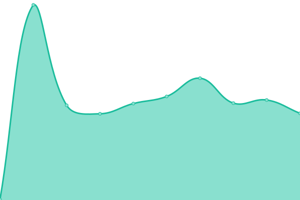
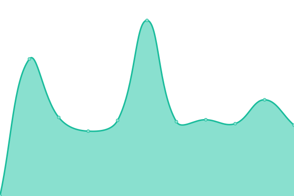

# [📈 Live Status](https://m1xzg.github.io/uptime): <!--live status--> **🟧 Partial outage**

This repository contains the open-source uptime monitor and status page for [Robert McKenzie](https://www.uk-experience.com), powered by [Upptime](https://github.com/upptime/upptime).

<!--start: status pages-->
<!-- This summary is generated by Upptime (https://github.com/upptime/upptime) -->
<!-- Do not edit this manually, your changes will be overwritten -->
<!-- prettier-ignore -->
| URL | Status | History | Response Time | Uptime |
| --- | ------ | ------- | ------------- | ------ |
|  [Zoraxy](http://bigbastard.letmeshoot.it:8000) | 🟩 Up | [zoraxy.yml](https://github.com/M1XZG/uptime/commits/HEAD/history/zoraxy.yml) | 

 661ms
     
 | 

<a href="https://m1xzg.github.io/uptime/history/zoraxy">100.00%</a>
    

|  [Dashboard](https://dash.rpmdp.com/freeboard/) | 🟩 Up | [dashboard.yml](https://github.com/M1XZG/uptime/commits/HEAD/history/dashboard.yml) | 

 629ms
     
 | 

<a href="https://m1xzg.github.io/uptime/history/dashboard">99.15%</a>
    

|  [FB](https://fb.letmeshoot.it/login) | 🟩 Up | [fb.yml](https://github.com/M1XZG/uptime/commits/HEAD/history/fb.yml) | 

 621ms
     
 | 

<a href="https://m1xzg.github.io/uptime/history/fb">99.15%</a>
    

|  [Flight Tracker (FA)](https://fa.letmeshoot.it) | 🟩 Up | [flight-tracker-fa.yml](https://github.com/M1XZG/uptime/commits/HEAD/history/flight-tracker-fa.yml) | 

 940ms
     
 | 

<a href="https://m1xzg.github.io/uptime/history/flight-tracker-fa">99.15%</a>
    

|  [Flight Tracker (FT)](https://ft.letmeshoot.it) | 🟩 Up | [flight-tracker-ft.yml](https://github.com/M1XZG/uptime/commits/HEAD/history/flight-tracker-ft.yml) | 

 849ms
     
 | 

<a href="https://m1xzg.github.io/uptime/history/flight-tracker-ft">99.15%</a>
    

|  [Wildys Lore](https://lore.wildwanderer-vr.com) | 🟩 Up | [wildys-lore.yml](https://github.com/M1XZG/uptime/commits/HEAD/history/wildys-lore.yml) | 

 885ms
     
 | 

<a href="https://m1xzg.github.io/uptime/history/wildys-lore">98.07%</a>
    

|  [Blog](https://www.uk-experience.com) | 🟩 Up | [blog.yml](https://github.com/M1XZG/uptime/commits/HEAD/history/blog.yml) | 

 1624ms
     
 | 

<a href="https://m1xzg.github.io/uptime/history/blog">100.00%</a>
    

|  [Reggie Walks](https://www.reggiewalkswitney.co.uk) | 🟩 Up | [reggie-walks.yml](https://github.com/M1XZG/uptime/commits/HEAD/history/reggie-walks.yml) | 

 2042ms
     
 | 

<a href="https://m1xzg.github.io/uptime/history/reggie-walks">100.00%</a>
    

|  [pi4-1 http](http://pi4-1.zt.rpmdp.com) | 🟩 Up | [pi4-1-http.yml](https://github.com/M1XZG/uptime/commits/HEAD/history/pi4-1-http.yml) | 

 259ms
     
 | 

<a href="https://m1xzg.github.io/uptime/history/pi4-1-http">100.00%</a>
    

|  [pi4-2 http](http://pi4-2.zt.rpmdp.com:8080) | 🟥 Down | [pi4-2-http.yml](https://github.com/M1XZG/uptime/commits/HEAD/history/pi4-2-http.yml) | 

 545ms
     
 | 

<a href="https://m1xzg.github.io/uptime/history/pi4-2-http">99.97%</a>
    

|  [NAS](http://172.16.29.2) | 🟩 Up | [nas.yml](https://github.com/M1XZG/uptime/commits/HEAD/history/nas.yml) | 

 414ms
     
 | 

<a href="https://m1xzg.github.io/uptime/history/nas">98.39%</a>
    

<!--end: status pages-->

[**Visit our status website →**](https://m1xzg.github.io/uptime)

## 📄 License

- Powered by: [Upptime](https://github.com/upptime/upptime)
- Code: [MIT](./LICENSE) © [Robert McKenzie](https://www.uk-experience.com)
- Data in the `./history` directory: [Open Database License](https://opendatacommons.org/licenses/odbl/1-0/)
