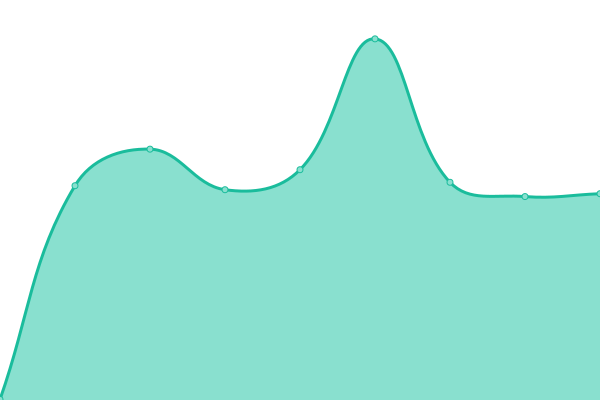

# [📈 Live Status](https://m1xzg.github.io/uptime): <!--live status--> **🟧 Partial outage**

This repository contains the open-source uptime monitor and status page for [Robert McKenzie](https://www.uk-experience.com), powered by [Upptime](https://github.com/upptime/upptime).

<!--start: status pages-->
<!-- This summary is generated by Upptime (https://github.com/upptime/upptime) -->
<!-- Do not edit this manually, your changes will be overwritten -->
<!-- prettier-ignore -->
| URL | Status | History | Response Time | Uptime |
| --- | ------ | ------- | ------------- | ------ |
|  [Zoraxy](http://bigbastard.letmeshoot.it:8000) | 🟩 Up | [zoraxy.yml](https://github.com/M1XZG/uptime/commits/HEAD/history/zoraxy.yml) | 

 521ms
     
 | 

<a href="https://m1xzg.github.io/uptime/history/zoraxy">100.00%</a>
    

|  [Dashboard](https://dash.rpmdp.com/freeboard/) | 🟩 Up | [dashboard.yml](https://github.com/M1XZG/uptime/commits/HEAD/history/dashboard.yml) | 

 552ms
     
 | 

<a href="https://m1xzg.github.io/uptime/history/dashboard">100.00%</a>
    

|  [Fileserver](https://fb.letmeshoot.it/login) | 🟩 Up | [fileserver.yml](https://github.com/M1XZG/uptime/commits/HEAD/history/fileserver.yml) | 

 448ms
     
 | 

<a href="https://m1xzg.github.io/uptime/history/fileserver">100.00%</a>
    

|  [Flight Tracker (FA)](https://fa.letmeshoot.it) | 🟩 Up | [flight-tracker-fa.yml](https://github.com/M1XZG/uptime/commits/HEAD/history/flight-tracker-fa.yml) | 

 4781ms
     
 | 

<a href="https://m1xzg.github.io/uptime/history/flight-tracker-fa">100.00%</a>
    

|  [Flight Tracker (FT)](https://ft.letmeshoot.it) | 🟩 Up | [flight-tracker-ft.yml](https://github.com/M1XZG/uptime/commits/HEAD/history/flight-tracker-ft.yml) | 

 1354ms
     
 | 

<a href="https://m1xzg.github.io/uptime/history/flight-tracker-ft">100.00%</a>
    

|  [Wildys Lore](https://lore.wildwanderer-vr.com) | 🟩 Up | [wildys-lore.yml](https://github.com/M1XZG/uptime/commits/HEAD/history/wildys-lore.yml) | 

 645ms
     
 | 

<a href="https://m1xzg.github.io/uptime/history/wildys-lore">100.00%</a>
    

|  [Blog](https://www.uk-experience.com) | 🟩 Up | [blog.yml](https://github.com/M1XZG/uptime/commits/HEAD/history/blog.yml) | 

 1460ms
     
 | 

<a href="https://m1xzg.github.io/uptime/history/blog">100.00%</a>
    

|  [Reggie Walks](https://www.reggiewalkswitney.co.uk) | 🟩 Up | [reggie-walks.yml](https://github.com/M1XZG/uptime/commits/HEAD/history/reggie-walks.yml) | 

 1981ms
     
 | 

<a href="https://m1xzg.github.io/uptime/history/reggie-walks">100.00%</a>
    

|  [Home](home.rpmdp.com) | 🟥 Down | [home.yml](https://github.com/M1XZG/uptime/commits/HEAD/history/home.yml) | 

 14ms
     
 | 

<a href="https://m1xzg.github.io/uptime/history/home">100.00%</a>
    

|  pi4-1 http [VPN] | 🟩 Up | [pi4-1-http-vpn.yml](https://github.com/M1XZG/uptime/commits/HEAD/history/pi4-1-http-vpn.yml) | 

 268ms
     
 | 

<a href="https://m1xzg.github.io/uptime/history/pi4-1-http-vpn">99.73%</a>
    

|  pi4-2 http [VPN] | 🟩 Up | [pi4-2-http-vpn.yml](https://github.com/M1XZG/uptime/commits/HEAD/history/pi4-2-http-vpn.yml) | 

 490ms
     
 | 

<a href="https://m1xzg.github.io/uptime/history/pi4-2-http-vpn">100.00%</a>
    

|  Edge Router [via VPN] | 🟩 Up | [edge-router-via-vpn.yml](https://github.com/M1XZG/uptime/commits/HEAD/history/edge-router-via-vpn.yml) | 

 173ms
     
 | 

<a href="https://m1xzg.github.io/uptime/history/edge-router-via-vpn">100.00%</a>
    

|  fritzbox [via VPN] | 🟩 Up | [fritzbox-via-vpn.yml](https://github.com/M1XZG/uptime/commits/HEAD/history/fritzbox-via-vpn.yml) | 

 637ms
     
 | 

<a href="https://m1xzg.github.io/uptime/history/fritzbox-via-vpn">100.00%</a>
    

|  docktopus [via VPN] | 🟩 Up | [docktopus-via-vpn.yml](https://github.com/M1XZG/uptime/commits/HEAD/history/docktopus-via-vpn.yml) | 

 109ms
     
 | 

<a href="https://m1xzg.github.io/uptime/history/docktopus-via-vpn">100.00%</a>
    

|  Helios (Streaming PC) [via VPN] | 🟩 Up | [helios-streaming-pc-via-vpn.yml](https://github.com/M1XZG/uptime/commits/HEAD/history/helios-streaming-pc-via-vpn.yml) | 

 144ms
     
 | 

<a href="https://m1xzg.github.io/uptime/history/helios-streaming-pc-via-vpn">100.00%</a>
    

|  NAS [via VPN] | 🟩 Up | [nas-via-vpn.yml](https://github.com/M1XZG/uptime/commits/HEAD/history/nas-via-vpn.yml) | 

 252ms
     
 | 

<a href="https://m1xzg.github.io/uptime/history/nas-via-vpn">100.00%</a>
    

|  tinkerbell [via VPN] | 🟩 Up | [tinkerbell-via-vpn.yml](https://github.com/M1XZG/uptime/commits/HEAD/history/tinkerbell-via-vpn.yml) | 

 83ms
     
 | 

<a href="https://m1xzg.github.io/uptime/history/tinkerbell-via-vpn">100.00%</a>
    

|  infra01 [via VPN] | 🟩 Up | [infra01-via-vpn.yml](https://github.com/M1XZG/uptime/commits/HEAD/history/infra01-via-vpn.yml) | 

 93ms
     
 | 

<a href="https://m1xzg.github.io/uptime/history/infra01-via-vpn">100.00%</a>
    

<!--end: status pages-->

[**Visit our status website →**](https://m1xzg.github.io/uptime)

## 📄 License

- Powered by: [Upptime](https://github.com/upptime/upptime)
- Code: [MIT](./LICENSE) © [Robert McKenzie](https://www.uk-experience.com)
- Data in the `./history` directory: [Open Database License](https://opendatacommons.org/licenses/odbl/1-0/)
